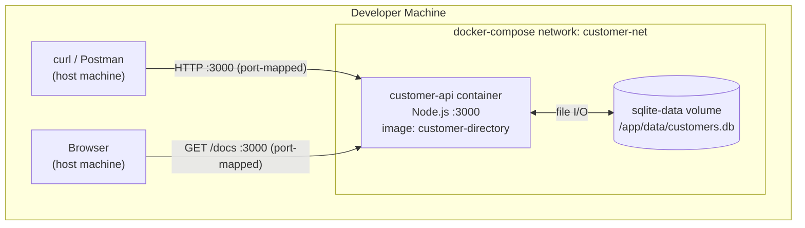
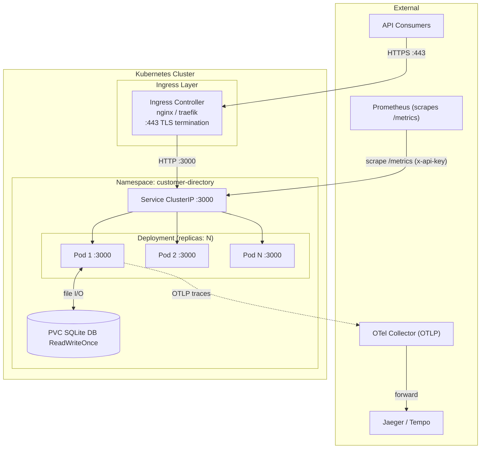
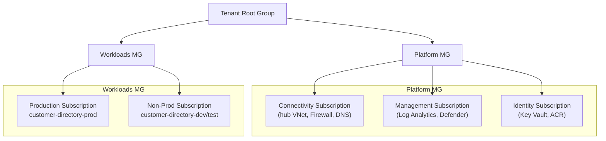
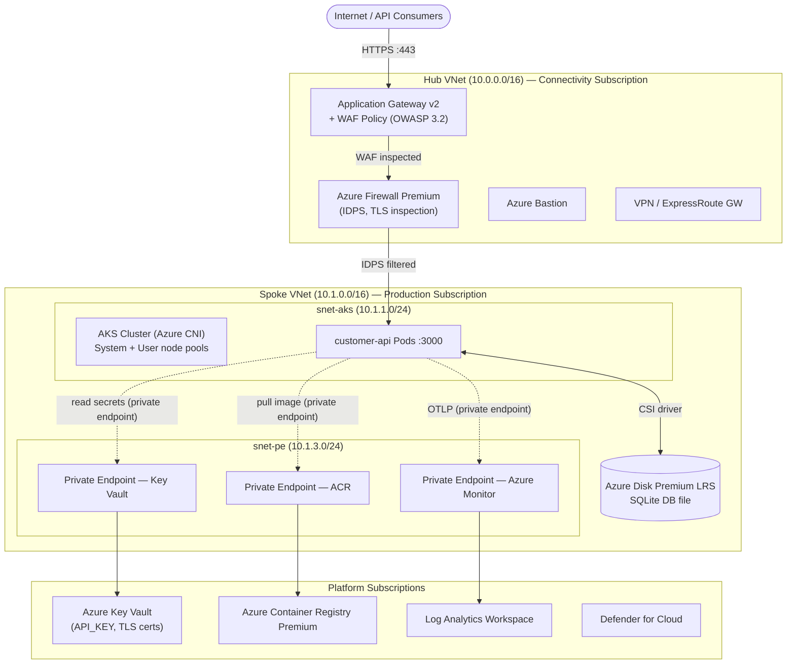
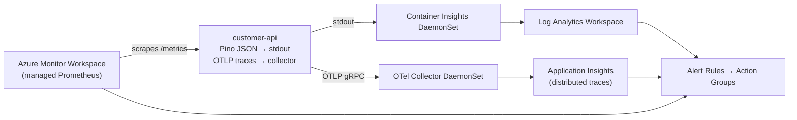
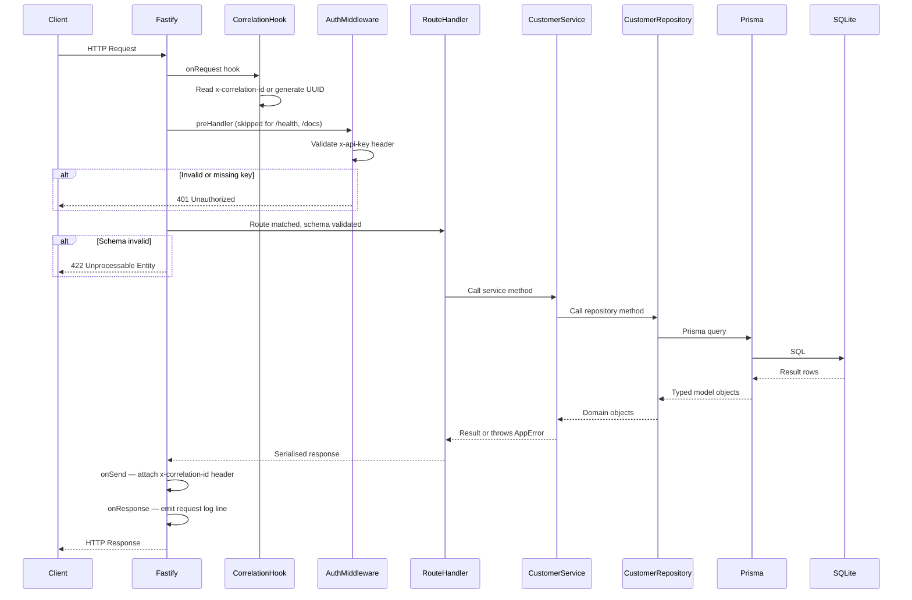
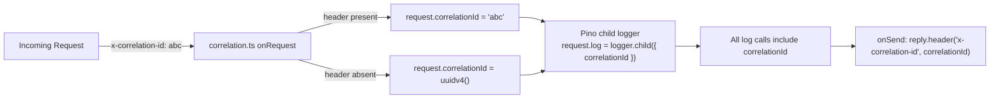
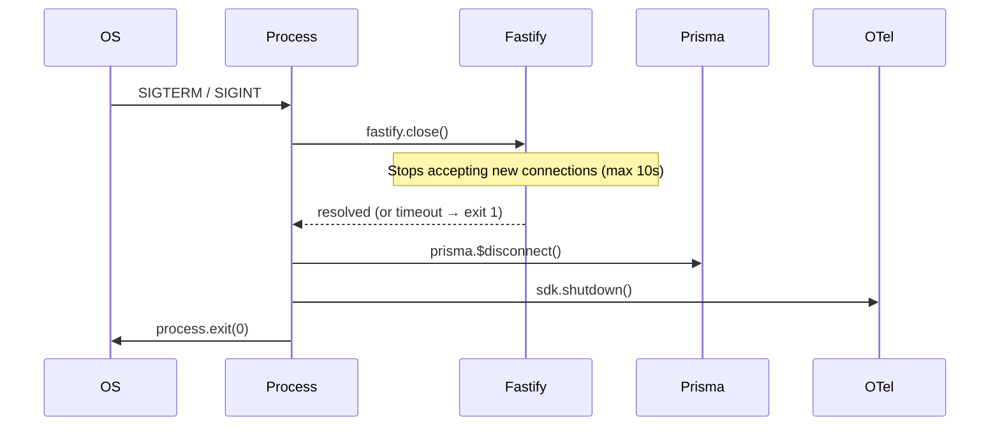

# Customer Directory Service — Full Specification

> **Document status:** Complete  
> **Last updated:** May 2025  
> **Covers:** Requirements · Architecture & Design · Azure Landing Zone · Azure WAF Policies · Cost Estimate · Implementation Tasks

---

## Table of Contents

1. [Introduction](#1-introduction)
2. [Requirements — Customer Directory Service](#2-requirements--customer-directory-service)
3. [Architecture & Design](#3-architecture--design)
   - 3.1 [Network Topology](#31-network-topology)
   - 3.2 [Azure Landing Zone](#32-azure-landing-zone)
   - 3.3 [Application Architecture](#33-application-architecture)
   - 3.4 [Data Models](#34-data-models)
   - 3.5 [Key Design Decisions](#35-key-design-decisions)
   - 3.6 [Correctness Properties](#36-correctness-properties)
   - 3.7 [Error Handling](#37-error-handling)
   - 3.8 [Testing Strategy](#38-testing-strategy)
   - 3.9 [Azure Hosting Cost Estimate](#39-azure-hosting-cost-estimate)
4. [Requirements — Azure WAF Policies](#4-requirements--azure-waf-policies)
5. [Implementation Tasks](#5-implementation-tasks)

---

## 1. Introduction

The Customer Directory Service is a production-ready REST API that manages a directory of customer records. It is designed to run locally and in Kubernetes, targeting public-sector-style clients who require strong security, structured observability, comprehensive testing, and clear documentation.

The service exposes CRUD operations over customer data, enforces API key authentication, emits OpenTelemetry traces and Prometheus metrics, and ships with a Swagger UI and a complete Docker-based local development setup.

### Tech Stack

| Concern | Choice |
|---|---|
| Language | TypeScript |
| Runtime | Node.js LTS |
| Framework | Fastify |
| Persistence | SQLite (Prisma ORM) |
| Auth | API key (`x-api-key` header) |
| Observability | OpenTelemetry (OTLP), Prometheus (`prom-client`), Pino JSON logs |
| Dev tooling | ESLint, Prettier, Vitest, fast-check |
| Packaging | Dockerfile, docker-compose |
| Cloud | Azure (AKS, hub-and-spoke landing zone) |

### Glossary

| Term | Definition |
|---|---|
| **Service** | The Customer Directory REST API application built with Node.js and Fastify |
| **Customer** | A record containing identity and contact information for a single customer entity |
| **API_Key** | A secret string passed in the `x-api-key` HTTP request header |
| **Validator** | The request validation layer responsible for checking input structure and field constraints |
| **Repository** | The data-access layer that mediates between the Service and the database via Prisma ORM |
| **Telemetry** | The OpenTelemetry SDK components responsible for emitting traces, metrics, and structured logs |
| **Correlation_ID** | A unique identifier attached to every request and propagated through logs and trace spans |
| **Error_Handler** | The centralised Fastify error hook that formats all error responses uniformly |
| **Graceful_Shutdown** | The process by which the Service stops accepting new requests, drains in-flight requests, and closes database connections before exiting |

---

## 2. Requirements — Customer Directory Service

### Requirement 1: Health Check Endpoint

**User Story:** As an operator, I want a public health check endpoint, so that load balancers and Kubernetes liveness probes can verify the service is running without needing credentials.

#### Acceptance Criteria

1. WHEN a `GET /health` request is received, THE Service SHALL respond with HTTP 200 and a JSON body containing `{ "status": "ok", "version": "<semver>" }`.
2. THE Service SHALL serve `GET /health` without requiring an `x-api-key` header.
3. WHEN the `GET /health` request is received, THE Service SHALL respond within 500ms under normal operating conditions.

---

### Requirement 2: API Key Authentication

**User Story:** As a security officer, I want all non-health endpoints protected by an API key, so that only authorised callers can read or modify customer data.

#### Acceptance Criteria

1. WHEN a request is received for any endpoint other than `GET /health`, THE Service SHALL inspect the `x-api-key` request header.
2. IF the `x-api-key` header is absent, THEN THE Service SHALL respond with HTTP 401 and a JSON body `{ "error": "Unauthorized", "message": "Missing API key" }`.
3. IF the `x-api-key` header value does not match the configured API key, THEN THE Service SHALL respond with HTTP 401 and a JSON body `{ "error": "Unauthorized", "message": "Invalid API key" }`.
4. THE Service SHALL read the valid API key value exclusively from an environment variable named `API_KEY`.
5. IF the `API_KEY` environment variable is not set at startup, THEN THE Service SHALL terminate with a non-zero exit code and log a descriptive error message.

---

### Requirement 3: Create Customer

**User Story:** As an API consumer, I want to create a new customer record, so that I can add customers to the directory.

#### Acceptance Criteria

1. WHEN a `POST /customers` request is received with a valid JSON body, THE Service SHALL persist a new Customer record and respond with HTTP 201 and the created Customer object.
2. THE Service SHALL assign a UUID v4 value to the `id` field of every newly created Customer.
3. THE Service SHALL set `createdAt` and `updatedAt` to the current UTC timestamp at the moment of creation.
4. THE Validator SHALL require the `name` field to be a non-empty string with a maximum length of 255 characters.
5. THE Validator SHALL require the `email` field to be a non-empty string in valid RFC 5322 email format.
6. THE Validator SHALL accept the `phone` field as an optional string with a maximum length of 50 characters.
7. IF the `name` field is absent or empty, THEN THE Validator SHALL respond with HTTP 422 and a JSON error body listing the specific field violation.
8. IF the `email` field is absent, malformed, or not a valid email address, THEN THE Validator SHALL respond with HTTP 422 and a JSON error body listing the specific field violation.
9. IF a Customer with the same `email` already exists, THEN THE Repository SHALL respond with HTTP 409 and a JSON body `{ "error": "Conflict", "message": "A customer with this email already exists" }`.

---

### Requirement 4: Retrieve Customer by ID

**User Story:** As an API consumer, I want to retrieve a single customer by their ID, so that I can view their details.

#### Acceptance Criteria

1. WHEN a `GET /customers/:id` request is received with a valid UUID, THE Service SHALL respond with HTTP 200 and the matching Customer object.
2. IF no Customer record exists for the given `:id`, THEN THE Service SHALL respond with HTTP 404 and a JSON body `{ "error": "Not Found", "message": "Customer not found" }`.
3. IF the `:id` path parameter is not a valid UUID v4 format, THEN THE Validator SHALL respond with HTTP 422 and a JSON error body describing the format violation.

---

### Requirement 5: List and Search Customers

**User Story:** As an API consumer, I want to list customers with optional search and pagination, so that I can browse and find customers efficiently.

#### Acceptance Criteria

1. WHEN a `GET /customers` request is received, THE Service SHALL respond with HTTP 200 and a JSON body containing `{ "data": [...], "total": <integer>, "page": <integer>, "pageSize": <integer> }`.
2. THE Service SHALL default the `page` query parameter to `1` when it is absent.
3. THE Service SHALL default the `pageSize` query parameter to `20` when it is absent.
4. THE Validator SHALL reject a `pageSize` value greater than `100` with HTTP 422 and a descriptive error message.
5. THE Validator SHALL reject a `page` value less than `1` with HTTP 422 and a descriptive error message.
6. WHEN the `search` query parameter is provided, THE Repository SHALL filter results to Customer records where `name` or `email` contains the search string using case-insensitive matching.
7. THE Service SHALL return an empty `data` array and `total` of `0` when no customers match the search criteria.
8. THE Service SHALL return customers ordered by `createdAt` descending by default.

---

### Requirement 6: Update Customer

**User Story:** As an API consumer, I want to update an existing customer's details, so that I can correct or enrich their information.

#### Acceptance Criteria

1. WHEN a `PUT /customers/:id` request is received with a valid JSON body, THE Service SHALL update the matching Customer record and respond with HTTP 200 and the updated Customer object.
2. THE Service SHALL set `updatedAt` to the current UTC timestamp at the moment of each update.
3. THE Validator SHALL apply the same field constraints for `name`, `email`, and `phone` as defined in Requirement 3, Acceptance Criteria 4–6.
4. IF no Customer record exists for the given `:id`, THEN THE Service SHALL respond with HTTP 404 and a JSON body `{ "error": "Not Found", "message": "Customer not found" }`.
5. IF the updated `email` value conflicts with an existing Customer record with a different `id`, THEN THE Repository SHALL respond with HTTP 409 and a JSON body `{ "error": "Conflict", "message": "A customer with this email already exists" }`.

---

### Requirement 7: Delete Customer

**User Story:** As an API consumer, I want to delete a customer record, so that I can remove outdated or incorrect entries from the directory.

#### Acceptance Criteria

1. WHEN a `DELETE /customers/:id` request is received, THE Service SHALL delete the matching Customer record and respond with HTTP 204 and no response body.
2. IF no Customer record exists for the given `:id`, THEN THE Service SHALL respond with HTTP 404 and a JSON body `{ "error": "Not Found", "message": "Customer not found" }`.
3. IF the `:id` path parameter is not a valid UUID v4 format, THEN THE Validator SHALL respond with HTTP 422 and a JSON error body describing the format violation.

---

### Requirement 8: Centralised Error Handling

**User Story:** As a security officer, I want all error responses to follow a consistent format without exposing internal details, so that the API surface is predictable and does not leak implementation information.

#### Acceptance Criteria

1. THE Error_Handler SHALL intercept all unhandled errors before they reach the HTTP response.
2. THE Error_Handler SHALL respond with a JSON body conforming to `{ "error": "<short title>", "message": "<human-readable description>" }` for all error responses.
3. IF an unhandled internal error occurs, THEN THE Error_Handler SHALL respond with HTTP 500 and the body `{ "error": "Internal Server Error", "message": "An unexpected error occurred" }`.
4. THE Error_Handler SHALL log the full error details including stack trace to the structured log at `error` level.
5. THE Error_Handler SHALL never include a stack trace or internal file path in the HTTP response body.

---

### Requirement 9: Structured Logging and Correlation IDs

**User Story:** As an operator, I want every log line to be structured JSON with a correlation ID, so that I can trace requests across distributed systems and query logs programmatically.

#### Acceptance Criteria

1. THE Service SHALL emit all log output as newline-delimited JSON to stdout.
2. THE Service SHALL generate a unique Correlation_ID for each incoming request.
3. WHEN a request includes a `x-correlation-id` header, THE Service SHALL use that value as the Correlation_ID instead of generating a new one.
4. THE Service SHALL include the Correlation_ID in every log line emitted during the processing of that request.
5. THE Service SHALL include the Correlation_ID in the HTTP response as the `x-correlation-id` header.
6. THE Service SHALL log each completed request at `info` level with fields: `method`, `url`, `statusCode`, `responseTimeMs`, and `correlationId`.

---

### Requirement 10: OpenTelemetry Observability

**User Story:** As an operator, I want distributed traces and metrics exported via OpenTelemetry, so that I can monitor service performance and diagnose latency issues in a Kubernetes environment.

#### Acceptance Criteria

1. THE Telemetry SHALL instrument all incoming HTTP requests as OpenTelemetry spans with attributes: `http.method`, `http.route`, `http.status_code`.
2. THE Telemetry SHALL instrument all Prisma database queries as child spans with the query operation name as the span name.
3. THE Telemetry SHALL record a custom span for the customer search operation including the sanitised search term length as a span attribute.
4. THE Telemetry SHALL export traces to an OTLP endpoint configurable via the `OTEL_EXPORTER_OTLP_ENDPOINT` environment variable.
5. WHERE the `OTEL_EXPORTER_OTLP_ENDPOINT` environment variable is not set, THE Telemetry SHALL default to no-op trace export without crashing.

---

### Requirement 11: Prometheus Metrics Endpoint

**User Story:** As an operator, I want a `/metrics` endpoint in Prometheus format, so that I can scrape service metrics from a Prometheus instance.

#### Acceptance Criteria

1. WHEN a `GET /metrics` request is received with a valid API key, THE Service SHALL respond with HTTP 200 and a Prometheus text exposition format body.
2. THE Metrics_Endpoint SHALL expose at minimum: `http_requests_total` (labelled by method, route, status), `http_request_duration_seconds` (histogram), and `process_uptime_seconds`.
3. THE Service SHALL protect `GET /metrics` with the same API key authentication defined in Requirement 2.

---

### Requirement 12: OpenAPI Documentation

**User Story:** As a developer integrating with the API, I want interactive API documentation, so that I can explore endpoints and test requests without reading source code.

#### Acceptance Criteria

1. THE Service SHALL expose a Swagger UI at `GET /docs`.
2. THE Service SHALL serve the raw OpenAPI 3.0 JSON specification at `GET /docs/json`.
3. THE Swagger_UI SHALL document all endpoints defined in Requirements 1–7 and 11, including request schemas, response schemas, and authentication requirements.
4. THE Service SHALL serve `GET /docs` and `GET /docs/json` without requiring an API key.

---

### Requirement 13: Persistence and Data Model

**User Story:** As a developer, I want the customer data persisted in a Prisma-managed SQLite database, so that data survives service restarts and the schema is version-controlled.

#### Acceptance Criteria

1. THE Database SHALL store Customer records with fields: `id` (UUID, primary key), `name` (string, required), `email` (string, unique, required), `phone` (string, nullable), `createdAt` (datetime), `updatedAt` (datetime).
2. THE Service SHALL manage all database schema changes through Prisma migrations stored in the `prisma/migrations/` directory.
3. WHEN the Service starts, THE Service SHALL verify the database connection and apply any pending migrations before accepting requests.
4. IF the database connection fails at startup, THEN THE Service SHALL terminate with a non-zero exit code and log a descriptive error message.

---

### Requirement 14: Graceful Shutdown

**User Story:** As an operator, I want the service to shut down gracefully on SIGTERM, so that in-flight requests complete and database connections are closed cleanly during Kubernetes pod termination.

#### Acceptance Criteria

1. WHEN the Service receives a `SIGTERM` or `SIGINT` signal, THE Service SHALL stop accepting new incoming connections.
2. WHEN the Service receives a `SIGTERM` or `SIGINT` signal, THE Service SHALL wait for all in-flight requests to complete before exiting, up to a maximum of 10 seconds.
3. WHEN the Service receives a `SIGTERM` or `SIGINT` signal, THE Service SHALL disconnect from the Database before the process exits.
4. IF in-flight requests do not complete within 10 seconds of receiving the shutdown signal, THEN THE Service SHALL forcibly close remaining connections and exit with code `1`.

---

### Requirement 15: Unit and Integration Testing

**User Story:** As a developer, I want a comprehensive test suite, so that I can confidently refactor and deploy the service.

#### Acceptance Criteria

1. THE Service SHALL include unit tests for the Validator covering valid inputs, missing required fields, malformed email addresses, and out-of-range pagination values.
2. THE Service SHALL include unit tests for the service layer covering create, read, update, delete, and list operations using a mocked Repository.
3. THE Service SHALL include integration tests for each API endpoint defined in Requirements 1–7 and 11, using a temporary SQLite database isolated per test run.
4. THE Service SHALL include a round-trip integration test: create → retrieve → update → verify updated fields match.
5. WHEN `npm test` is executed, THE Service SHALL run all unit and integration tests and exit with code `0` when all tests pass.
6. THE Service SHALL achieve a minimum of 80% line coverage across the `src/` directory.

---

### Requirement 16: Build, Lint, and Containerisation

**User Story:** As a developer, I want a reproducible build, lint, and Docker packaging pipeline, so that the service can be built and deployed consistently across environments.

#### Acceptance Criteria

1. WHEN `npm run build` is executed, THE Service SHALL compile TypeScript sources to the `dist/` directory without errors.
2. WHEN `npm run lint` is executed, THE Service SHALL report zero ESLint violations across all `src/` and `tests/` files.
3. THE Service SHALL include a `Dockerfile` that produces a minimal production image using a Node.js LTS base, copies only compiled output and production dependencies, and exposes port `3000`.
4. THE Service SHALL include a `docker-compose.yml` that starts the Service container, mounts a named volume for the SQLite database file, and passes required environment variables from a `.env` file.
5. WHEN `docker compose up` is executed with a valid `.env` file, THE Service SHALL start and respond to `GET /health` within 30 seconds.
6. THE Service SHALL include a `.env.example` file documenting all required and optional environment variables with descriptions and example values.

---

## 3. Architecture & Design

The Customer Directory Service is built with **Node.js + TypeScript** and the **Fastify** web framework. It follows a **layered architecture** with strict unidirectional dependencies: Fastify HTTP Server → Service Layer → Repository Layer → Prisma ORM + SQLite.

**Why Fastify over Express:**
- Schema-first validation — native JSON Schema integration enables automatic OpenAPI spec generation via `@fastify/swagger`
- Performance — low-overhead routing and serialisation pipeline
- Plugin ecosystem — first-party plugins cover all cross-cutting concerns without custom middleware boilerplate

---

### 3.1 Network Topology

#### Local — Docker Compose



- Single container, port `3000` mapped to the host
- SQLite persisted on a named Docker volume — survives container restarts
- No sidecar or external services required locally; OTel is a no-op when `OTEL_EXPORTER_OTLP_ENDPOINT` is unset

#### Production — Kubernetes



| Concern | Decision |
|---|---|
| **TLS** | Terminated at the Ingress controller — pods communicate over plain HTTP internally |
| **Auth** | `API_KEY` injected from a Kubernetes `Secret` — never baked into the image |
| **SQLite + replicas** | `ReadWriteOnce` PVC — single writer. For true horizontal scaling, migrate to PostgreSQL |
| **Traces** | Pods push OTLP spans to OTel Collector → Jaeger/Tempo |
| **Graceful shutdown** | Kubernetes sends `SIGTERM` → pod drains in-flight requests (max 10s) → `SIGKILL` |

---

### 3.2 Azure Landing Zone

The service is hosted in an Azure Landing Zone following the [ALZ conceptual architecture](https://learn.microsoft.com/en-us/azure/cloud-adoption-framework/ready/landing-zone/) with hub-and-spoke topology, centralised governance, and defence-in-depth security.

#### Management Group Hierarchy



**Policy assignments at Management Group level:**
- `Deny` public IP on resources without explicit exemption
- `Require` diagnostic settings forwarded to central Log Analytics Workspace
- `Require` private endpoints for PaaS services (Key Vault, ACR, etc.)
- `Audit` resources without resource locks on production

#### Hub-and-Spoke Network



#### Resource Inventory

| Resource | SKU / Tier | Purpose |
|---|---|---|
| Application Gateway v2 | WAF_v2 | TLS termination, WAF (OWASP 3.2), path-based routing |
| Azure Firewall Premium | Premium | IDPS, TLS inspection, east-west + egress filtering |
| AKS Cluster | Standard, Azure CNI | Hosts customer-api pods; system + user node pools |
| Azure Disk Premium LRS | 32 GB | Persistent volume for SQLite DB file (CSI driver) |
| Azure Container Registry | Premium | Private image registry |
| Azure Key Vault | Standard | Stores `API_KEY` secret, TLS certificates |
| User-Assigned Managed Identity | — | Grants AKS workload identity access to Key Vault and ACR |
| Log Analytics Workspace | Pay-as-you-go | Central sink for AKS diagnostics, container logs, metrics |
| Azure Monitor / App Insights | — | Receives OTLP traces |
| Microsoft Defender for Cloud | Defender for Containers | Runtime threat detection |
| Azure Bastion | Standard | Secure admin access — no public SSH |
| Private DNS Zones | — | Name resolution for all private endpoints |
| Network Security Groups | — | Subnet-level micro-segmentation |
| Azure Policy | Built-in + custom | Governance guardrails at Management Group level |

#### Security Controls

| Layer | Controls |
|---|---|
| **Perimeter** | WAF Policy (OWASP 3.2), rate limiting, bot protection, DDoS Network Protection |
| **Network** | Azure Firewall IDPS, NSGs (deny-by-default), private endpoints for all PaaS |
| **Identity & Secrets** | Workload Identity (no stored creds), Key Vault (soft-delete + purge protect), Azure RBAC least-privilege |
| **Data** | Encryption at rest (Azure-managed keys), TLS 1.2+ in transit |
| **Detection** | Defender for Containers, audit logs → Log Analytics, Azure Monitor Alerts |

**API Key handling:** `API_KEY` stored in Key Vault, mounted into pods via Secrets Store CSI Driver. Pod's Managed Identity has `Key Vault Secrets User` RBAC role — no client secrets required.

#### AKS Configuration

```yaml
networkPlugin: azure          # Azure CNI — pods get VNet IPs
networkPolicy: calico          # Pod-level network policies
privatecluster: true           # API server not publicly reachable
enableOIDCIssuer: true         # Required for Workload Identity
enableWorkloadIdentity: true
monitoringAddon: true
defenderAddon: true
autoUpgradeChannel: patch

systemPool:
  vmSize: Standard_D2s_v5
  count: 2
  mode: System

userPool:
  vmSize: Standard_D4s_v5
  minCount: 2
  maxCount: 10
  mode: User
  enableAutoScaling: true
```

#### Observability Pipeline



#### CI/CD and Image Supply Chain

```mermaid
graph LR
    DEV["Developer push"] --> PIPE["Azure DevOps / GitHub Actions"]
    PIPE -->|"lint + test + build"| BUILD["Build + Test"]
    BUILD -->|"docker build"| IMG["Container Image"]
    IMG -->|"trivy scan (CRITICAL = fail)"| SCAN["Vulnerability Scan"]
    SCAN -->|"digest-pinned push"| ACR2["Azure Container Registry"]
    ACR2 -->|"AKS pulls via private endpoint"| AKS2["AKS Deployment (rolling)"]
    AKS2 -->|"GET /health smoke test"| VERIFY["Post-deploy Verification"]
```



- Images tagged by Git SHA, digest-pinned in manifests — no `latest` in production
- ACR Tasks run `trivy`; `CRITICAL` CVEs quarantine the image
- Azure Policy blocks pods pulling from non-approved registries

#### Environment Summary

| Environment | Subscription | AKS Replicas | Storage | Notes |
|---|---|---|---|---|
| Local | n/a | n/a | Docker volume | `docker compose up` |
| Dev | customer-directory-nonprod | 1 | Azure Files Standard | Auto-deployed on PR merge |
| Test | customer-directory-nonprod | 1 | Azure Files Standard | Integration + load tests |
| Production | customer-directory-prod | 2–10 (autoscale) | Azure Disk Premium LRS | Manual approval gate |

> **SQLite scaling note:** SQLite with `ReadWriteOnce` works for single-writer workloads. For concurrent writes across multiple replicas, migrate to **Azure Database for PostgreSQL Flexible Server** and update the Prisma provider.

---

### 3.3 Application Architecture

#### Layered Architecture

```
HTTP Request
     │
     ▼
┌─────────────────────────────────────────────────────┐
│                  Fastify HTTP Server                │
│  OTel Plugin │ Correlation ID Hook │ Auth Middleware │
│              Route Handlers                         │
│  /health  /customers  /metrics  /docs               │
│              Centralised Error Handler              │
└─────────────────────────────────────────────────────┘
     │
     ▼
┌─────────────────────────────────────────────────────┐
│   Service Layer — CustomerService                   │
│   (business logic, conflict checks, OTel spans)     │
└─────────────────────────────────────────────────────┘
     │
     ▼
┌─────────────────────────────────────────────────────┐
│   Repository Layer — CustomerRepository             │
│   (Prisma queries, DB mapping, error translation)   │
└─────────────────────────────────────────────────────┘
     │
     ▼
┌─────────────────────────────────────────────────────┐
│              Prisma ORM + SQLite DB                 │
└─────────────────────────────────────────────────────┘
```

#### Request Flow



#### Component Responsibilities

| Component | Responsibility |
|---|---|
| `src/index.ts` | Bootstrap: validate config, init OTel, create app, run migrations, start server, register signal handlers |
| `src/app.ts` | Fastify factory: register all plugins and routes, export for testing |
| `src/config.ts` | Read and validate all env vars at startup; fail fast if required vars are missing |
| `src/plugins/telemetry.ts` | Initialise OTel Node SDK with HTTP and Prisma instrumentations |
| `src/plugins/correlation.ts` | `onRequest`: read/generate correlation ID; `onSend`: write back to response header |
| `src/plugins/auth.ts` | `preHandler` hook scoped to all routes except `/health`, `/docs`, `/docs/json` |
| `src/plugins/errorHandler.ts` | Map `AppError` subclasses to HTTP status; 500 for unknowns; never leak stack traces |
| `src/plugins/metrics.ts` | `prom-client` default metrics + `http_requests_total` + `http_request_duration_seconds`; `GET /metrics` route |
| `src/plugins/swagger.ts` | `@fastify/swagger` OpenAPI 3.0 + `@fastify/swagger-ui` at `/docs` |
| `src/routes/health.ts` | `GET /health` — no auth, returns `{ status, version }` |
| `src/routes/customers.ts` | CRUD routes with JSON Schema; delegates to `CustomerService` |
| `src/services/CustomerService.ts` | UUID generation, timestamps, conflict detection, search/pagination, custom OTel span |
| `src/repositories/CustomerRepository.ts` | All Prisma queries; translates `P2002` → `ConflictError` |
| `src/errors/AppError.ts` | `NotFoundError` (404), `ConflictError` (409), `ValidationError` (422), `UnauthorizedError` (401) |
| `src/schemas/customer.schema.ts` | Single source of truth for validation, serialisation, and OpenAPI docs |

#### Folder Structure

```
customer-directory-service/
├── prisma/
│   ├── schema.prisma
│   └── migrations/
├── src/
│   ├── index.ts
│   ├── app.ts
│   ├── config.ts
│   ├── logger.ts
│   ├── db/prisma.ts
│   ├── errors/AppError.ts
│   ├── plugins/
│   │   ├── auth.ts
│   │   ├── correlation.ts
│   │   ├── errorHandler.ts
│   │   ├── metrics.ts
│   │   ├── swagger.ts
│   │   └── telemetry.ts
│   ├── routes/
│   │   ├── health.ts
│   │   └── customers.ts
│   ├── schemas/customer.schema.ts
│   ├── services/CustomerService.ts
│   └── repositories/CustomerRepository.ts
├── tests/
│   ├── unit/
│   │   ├── validator.test.ts
│   │   └── customerService.test.ts
│   └── integration/
│       ├── health.test.ts
│       ├── customers.test.ts
│       └── metrics.test.ts
├── Dockerfile
├── docker-compose.yml
├── .env.example
├── package.json
└── tsconfig.json
```

---

### 3.4 Data Models

#### Prisma Schema

```prisma
model Customer {
  id        String   @id @default(uuid())
  name      String
  email     String   @unique
  phone     String?
  createdAt DateTime @default(now())
  updatedAt DateTime @updatedAt
}
```

#### TypeScript Domain Type

```typescript
interface Customer {
  id: string;           // UUID v4
  name: string;         // 1–255 chars
  email: string;        // RFC 5322, unique
  phone: string | null; // 0–50 chars, optional
  createdAt: string;    // ISO 8601 UTC
  updatedAt: string;    // ISO 8601 UTC
}
```

#### API Shapes

**POST /customers / PUT /customers/:id body:**
```json
{ "name": "string", "email": "string", "phone": "string?" }
```

**GET /customers response:**
```json
{ "data": [Customer], "total": 42, "page": 1, "pageSize": 20 }
```

**All error responses:**
```json
{ "error": "string", "message": "string" }
```

---

### 3.5 Key Design Decisions

#### 1. OTel Initialisation Must Be First

The OTel Node SDK patches Node.js built-ins at import time. `src/index.ts` must call `initTelemetry()` before any other imports.

```
index.ts execution order:
  1. initTelemetry()          ← must be first
  2. validateConfig()
  3. buildApp()
  4. prisma.$connect() + migrate
  5. fastify.listen()
  6. register SIGTERM/SIGINT handlers
```

When `OTEL_EXPORTER_OTLP_ENDPOINT` is not set, the SDK uses a `NoopSpanExporter` — no crash.

#### 2. Correlation ID Flow



#### 3. Auth Scope via Sub-Router

```
Fastify instance
├── GET /health          ← no auth
├── GET /docs            ← no auth
├── GET /docs/json       ← no auth
└── [auth-scoped plugin]
    ├── preHandler: validateApiKey
    ├── GET /customers
    ├── POST /customers
    ├── GET /customers/:id
    ├── PUT /customers/:id
    ├── DELETE /customers/:id
    └── GET /metrics
```

#### 4. Graceful Shutdown Sequence



#### 5. JSON Schema as Single Source of Truth

`src/schemas/customer.schema.ts` drives request validation, response serialisation, and OpenAPI spec generation — all from one place.

#### 6. Repository Error Translation

Prisma `P2002` (unique constraint) → `ConflictError` → HTTP 409. Prisma stays an implementation detail; the service layer never sees Prisma error types.

---

### 3.6 Correctness Properties

These properties are formally verified using property-based tests (fast-check, 100 iterations minimum each).

| # | Property | Validates |
|---|---|---|
| P1 | **Creation round-trip** — POST then GET returns identical `name`, `email`, `phone` | Req 3.1, 4.1 |
| P2 | **Server-assigned fields** — `id` is UUID v4; `createdAt`/`updatedAt` are valid ISO 8601 UTC | Req 3.2, 3.3 |
| P3 | **Name validation boundary** — empty or >255 chars → 422; 1–255 chars → accepted | Req 3.4, 3.7 |
| P4 | **Email validation** — non-RFC-5322 strings → 422; valid emails → accepted | Req 3.5, 3.8 |
| P5 | **Search correctness** — every result contains the search term; no non-matching result appears | Req 5.6, 5.7 |
| P6 | **List ordering** — `data[i].createdAt >= data[i+1].createdAt` for all `i` | Req 5.8 |
| P7 | **Update round-trip** — GET after PUT returns updated fields; `updatedAt` ≥ `createdAt` | Req 6.1, 6.2 |
| P8 | **Delete removes record** — DELETE → 204; subsequent GET → 404 | Req 7.1 |
| P9 | **Error response schema** — all 4xx/5xx responses have `{ error, message }` and no stack trace | Req 8.2, 8.3, 8.5 |
| P10 | **Correlation ID echo** — provided header echoed back; absent header → UUID v4 generated | Req 9.3, 9.5 |

---

### 3.7 Error Handling

#### Error Hierarchy

```
AppError (base)
├── UnauthorizedError   → HTTP 401
├── ValidationError     → HTTP 422
├── NotFoundError       → HTTP 404
├── ConflictError       → HTTP 409
└── (unknown/unhandled) → HTTP 500
```

The `setErrorHandler` callback:
1. `AppError` instance → maps to HTTP status, formats `{ error, message }`
2. Fastify schema validation error → 422 with field details
3. All other errors → logs full stack at `error` level, returns 500 with generic message
4. Never includes `err.stack`, file paths, or Prisma internals in the response body

**Startup failures** (immediate `process.exit(1)`):**
- `API_KEY` env var not set
- Database connection fails during `prisma.$connect()`

---

### 3.8 Testing Strategy

**Unit tests** (`tests/unit/`):
- Validator: valid inputs, missing fields, malformed emails, out-of-range pagination
- `CustomerService`: all CRUD operations with mocked `CustomerRepository`

**Integration tests** (`tests/integration/`):
- Every API endpoint with isolated temporary SQLite DB per test run
- Full CRUD round-trip, auth middleware, pagination defaults, search filtering, metrics format

**Property-based tests** (fast-check, 100 iterations each):
- All 10 correctness properties listed in §3.6
- Tagged with `// Feature: customer-directory-service, Property N: <title>`

**Coverage gate:** 80% line coverage across `src/` via Vitest + `@vitest/coverage-v8`

---

### 3.9 Azure Hosting Cost Estimate

All prices are **East US region, pay-as-you-go, USD, May 2025** (list price). Sources: [Azure pricing](https://azure.microsoft.com/en-us/pricing/), [vantage.sh](https://instances.vantage.sh/azure/vm/d4s-v5), [Microsoft Learn](https://learn.microsoft.com/en-us/answers/questions/1692318/defender-for-container-pricing-question).

#### Assumptions

| Parameter | Value |
|---|---|
| AKS user nodes (prod) | 2–4 × Standard_D4s_v5 (4 vCPU, 16 GiB) |
| AKS system nodes | 2 × Standard_D2s_v5 (2 vCPU, 8 GiB) |
| Monthly traffic | ~1M requests, ~50 GB through firewall |
| Log ingestion | ~10 GB/month |
| SQLite storage | Azure Disk Premium LRS, 32 GB |

#### Production Monthly Breakdown

| Category | Resource | Monthly |
|---|---|---|
| **Compute** | AKS Standard control plane | $73 |
| | System nodes D2s_v5 × 2 | $140 |
| | User nodes D4s_v5 × 2 (baseline) | $280 |
| | User nodes D4s_v5 × 2 (burst ~20%) | $56 |
| | **Compute subtotal** | **~$549** |
| **Networking** | Azure Firewall Premium | ~$1,798 |
| | Application Gateway v2 + WAF | ~$192 |
| | Azure Bastion Standard | $212 |
| | Public IPs × 2 + VNet peering | $7 |
| | **Networking subtotal** | **~$2,209** |
| **Storage** | Azure Disk Premium LRS (32 GB) | $5 |
| | Azure Container Registry Premium | $20 |
| | **Storage subtotal** | **~$25** |
| **Security & Obs.** | Defender for Containers (16 vCores × $7) | $112 |
| | Log Analytics (5 GB billable) | $14 |
| | Azure Monitor / App Insights | $6 |
| | Key Vault | $2 |
| | **Security subtotal** | **~$134** |
| | **Production total** | **~$2,917/month (~$35,000/year)** |

#### Non-Production (Dev + Test)

~$932/month — single node, Firewall Standard, no Bastion, no WAF.

#### Cost Optimisation Options

| Option | Monthly Saving | Trade-off |
|---|---|---|
| 1-year Reserved — Firewall + VMs | ~$820 | Upfront commitment |
| Downgrade to Firewall Standard | ~$600 | Loses IDPS + TLS inspection |
| Replace Firewall + AGW with Azure Front Door Premium | ~$1,400 | No hub-and-spoke private network |
| Spot instances for burst nodes | ~80% on burst | Pod eviction risk |

#### Total Cost of Ownership

| Scenario | Monthly | Annual |
|---|---|---|
| Pay-as-you-go (prod + non-prod) | ~$3,849 | ~$46,184 |
| 1-year reservations (prod + non-prod) | ~$3,032 | ~$36,384 |
| EA/CSP discount (15–30%) applied | ~$2,700–$3,270 | ~$32,000–$39,000 |

> Use the [Azure Pricing Calculator](https://azure.microsoft.com/en-us/pricing/calculator/) with your EA/CSP agreement for a binding quote.

---

## 4. Requirements — Azure WAF Policies

This section covers the Azure Policy definitions, initiatives, and assignment templates that enforce the five pillars of the Azure Well-Architected Framework across the Customer Directory Service landing zone.

All policies use built-in Azure Policy definitions where available. Custom definitions are created only where no built-in covers the requirement. All artefacts are expressed as Bicep/ARM files under `infra/policies/`.

### Folder Structure

```
infra/policies/
├── reliability/
├── security/
├── cost-optimisation/
├── operational-excellence/
├── performance-efficiency/
├── initiatives/
│   ├── WAF-Reliability-Initiative.json
│   ├── WAF-Security-Initiative.json
│   ├── WAF-CostOptimisation-Initiative.json
│   ├── WAF-OperationalExcellence-Initiative.json
│   └── WAF-PerformanceEfficiency-Initiative.json
├── assignments/
│   ├── assignment.bicep
│   └── parameters.prod.json / parameters.nonprod.json
└── README.md
```

---

### Pillar 1: Reliability

| # | Policy | Type | Effect | Built-in ID |
|---|---|---|---|---|
| R1 | Availability zones on AKS, AGW, Firewall | Custom | Deny | — |
| R2 | `CanNotDelete` resource locks on prod resource groups | Custom | DeployIfNotExists | — |
| R3 | Health probes on Application Gateway backend pools | Custom | Audit | — |
| R4 | AKS user node pool autoscaler enabled | Custom | Deny | — |

**Initiative:** `WAF-Reliability-Initiative`

#### Requirement 1: Availability Zones
WHEN a supported resource (AKS node pool, AGW v2, Azure Firewall) is created without AZ configuration, THE Policy_Engine SHALL deny the operation. Existing non-AZ resources SHALL be reported as non-compliant.

#### Requirement 2: Resource Locks on Production
WHEN a resource in the Production Subscription is created without a `CanNotDelete` lock, THE Policy_Engine SHALL deploy one via `deployIfNotExists` scoped to resource groups tagged `environment: prod`.

#### Requirement 3: Health Probes
THE Policy_Engine SHALL audit Application Gateway v2 instances with backend pools that have no custom health probe and emit audit events to Log Analytics.

#### Requirement 4: AKS Autoscale
WHEN an AKS user node pool is created with `enableAutoScaling: false`, THE Policy_Engine SHALL deny the operation. System node pools are exempt.

---

### Pillar 2: Security

| # | Policy | Type | Effect | Built-in ID |
|---|---|---|---|---|
| S1 | Key Vault private endpoint | Built-in | Audit | `a6abeaec-4d90-4a02-805f-6b26c4d3fbe9` |
| S2 | ACR private endpoint | Built-in | Audit | `e8eef0a8-67cf-4eb4-9386-14b0e78733d4` |
| S3 | Deny public IPs in Workloads MG | Custom | Deny | — |
| S4 | Key Vault TLS 1.2 minimum | Built-in | Deny | `1f314764-cb73-4fc9-b863-8eca98ac36e9` |
| S5 | Key Vault soft-delete (90 days) | Built-in | Deny | `1e66c121-a66a-4b1f-9b83-0fd99bf0fc2d` |
| S6 | Key Vault purge protection | Built-in | Deny | `0b60c0b2-2dc2-4e1c-b5c9-abbed971de53` |
| S7 | Defender for Containers enabled | Built-in | Audit | `1c988dd6-ade4-430f-a608-2a3e5b0a6d38` |
| S8 | No privileged containers in AKS | Built-in | Deny | `95edb821-ddaf-4404-9732-666045e70207` |
| S9 | Approved container registries only | Built-in | Deny | `febd0533-8e55-448f-b837-bd0e06f16469` |

**Initiative:** `WAF-Security-Initiative`

Key requirements:
- Public IPs denied in Workloads MG unless tagged `public-ip-exemption: true`; hub VNet public IPs (AGW, Firewall) are in Platform MG scope and unaffected
- Privileged containers denied in all namespaces except `kube-system` and `gatekeeper-system`
- Approved ACR hostname supplied via Parameters_File — different values for prod vs non-prod

---

### Pillar 3: Cost Optimisation

| # | Policy | Type | Effect | Built-in ID |
|---|---|---|---|---|
| C1 | Require `costCentre` tag | Built-in | Deny | `871b6d14-10aa-478d-b590-94f262ecfa99` |
| C2 | Require `environment` tag | Built-in | Deny | `871b6d14-10aa-478d-b590-94f262ecfa99` |
| C3 | Require `owner` tag | Built-in | Deny | `871b6d14-10aa-478d-b590-94f262ecfa99` |
| C4 | Budget alert existence | Custom | Audit | — |
| C5 | Approved VM SKUs | Built-in | Deny | `cccc23c7-8427-4f53-ad12-b6a63eb452b3` |

**Initiative:** `WAF-CostOptimisation-Initiative`

Key requirements:
- Three mandatory tags (`costCentre`, `environment`, `owner`) — deny on missing; allowed `environment` values parameterised (`["prod", "dev", "test"]`)
- Budget alert audit is a custom policy (no built-in covers subscription-level budget existence)
- Approved SKU list (`["Standard_D2s_v5", "Standard_D4s_v5", "Standard_D8s_v5"]`) supplied via Parameters_File

---

### Pillar 4: Operational Excellence

| # | Policy | Type | Effect | Built-in ID |
|---|---|---|---|---|
| O1 | Diagnostic settings → Log Analytics (Key Vault) | Built-in | DeployIfNotExists | `bef3f64c-5290-43b7-85b0-9b254eef4c47` |
| O2 | Diagnostic settings → Log Analytics (AKS) | Built-in | DeployIfNotExists | `6c66c325-74c8-42fd-a286-a74b0e2939d8` |
| O3 | Naming convention enforcement | Custom | Audit | — |
| O4 | Activity log retention ≥ 365 days | Built-in | Audit | `b02aacc0-b073-424e-8298-42b22829ee0a` |

**Initiative:** `WAF-OperationalExcellence-Initiative`

Key requirements:
- Diagnostic settings auto-deployed within 30 minutes of remediation task execution
- Log Analytics Workspace resource ID supplied via Parameters_File (different for prod vs non-prod)
- Naming convention: `aks-` prefix for AKS clusters, `kv-` for Key Vaults, `rg-` for resource groups

---

### Pillar 5: Performance Efficiency

| # | Policy | Type | Effect | Built-in ID |
|---|---|---|---|---|
| P1 | AKS user node pool autoscale + `minCount ≥ 2` | Custom | Deny | — |
| P2 | Container CPU/memory requests and limits required | Custom | Deny | — |

**Initiative:** `WAF-PerformanceEfficiency-Initiative`

Key requirements:
- `minCount < 2` on user node pools → deny (custom policy; no built-in covers this)
- Containers without CPU request, memory request, CPU limit, or memory limit → deny
- `kube-system` and `gatekeeper-system` namespaces exempt from resource limit enforcement

---

### Assignment Templates

| Setting | Production | Non-Production |
|---|---|---|
| `enforcementMode` | `Default` (enforced) | `DoNotEnforce` (audit only) |
| Scope | Workloads MG | Workloads MG |
| Managed Identity | System-assigned, minimum RBAC for `deployIfNotExists` | Same |
| Parameters | `parameters.prod.json` | `parameters.nonprod.json` |

Assignment templates support both Management Group and Subscription scope via a single parameter — no separate template files needed.

Custom policy definition files include a `metadata` block:
```json
{
  "metadata": {
    "wafPillar": "Security",
    "wafPrinciple": "Deny public network access",
    "policyType": "Custom",
    "version": "1.0.0"
  }
}
```

---

## 5. Implementation Tasks

### Overview

Implement a production-ready Fastify + TypeScript REST API with Prisma/SQLite persistence, API key auth, OpenTelemetry tracing, Prometheus metrics, Swagger docs, structured logging with correlation IDs, and graceful shutdown. Layered architecture: Fastify → Service → Repository → Prisma/SQLite.

Tasks marked `*` are optional property-based tests — can be skipped for a faster MVP.

---

- [ ] **1. Project scaffolding**
  - Initialise `package.json` with all dependencies and devDependencies
  - Create `tsconfig.json` (ES2022, strict, outDir: dist)
  - Create `.eslintrc.json` and `.prettierrc`
  - Create full folder structure
  - Add npm scripts: `build`, `start`, `dev`, `lint`, `test`, `test:coverage`
  - *Requirements: 16.1, 16.2*

- [ ] **2. Prisma schema and migration**
  - Create `prisma/schema.prisma` with `Customer` model
  - Run `prisma migrate dev --name init`
  - Run `prisma generate`
  - *Requirements: 13.1, 13.2*

- [ ] **3. Core infrastructure modules**
  - [ ] 3.1 `src/config.ts` — validate env vars, fail fast on missing `API_KEY` *(Req 2.4, 2.5)*
  - [ ] 3.2 `src/logger.ts` — Pino JSON stdout, respects `LOG_LEVEL` *(Req 9.1)*
  - [ ] 3.3 `src/errors/AppError.ts` — base class + 4 subclasses *(Req 8.1, 8.2)*
  - [ ] 3.4 `src/db/prisma.ts` — singleton `PrismaClient` *(Req 13.3)*

- [ ] **4. Telemetry plugin**
  - `src/plugins/telemetry.ts` — OTel SDK with HTTP + Prisma auto-instrumentation
  - Export `initTelemetry()` — must be called first in `src/index.ts`
  - `NoopSpanExporter` when `OTEL_EXPORTER_OTLP_ENDPOINT` not set
  - *Requirements: 10.1, 10.2, 10.4, 10.5*

- [ ] **5. Fastify app factory and plugins**
  - [ ] 5.1 `src/plugins/correlation.ts` — read/generate correlation ID, Pino child logger, echo header *(Req 9.2–9.5)*
  - [ ] 5.2 `src/plugins/auth.ts` — `preHandler` scoped sub-router, `UnauthorizedError` on fail *(Req 2.1–2.3)*
  - [ ] 5.3 `src/plugins/errorHandler.ts` — map `AppError` → HTTP status, 500 for unknowns, no stack traces *(Req 8.1–8.5)*
  - [ ] 5.4 `src/plugins/swagger.ts` — OpenAPI 3.0 + Swagger UI at `/docs` *(Req 12.1–12.4)*
  - [ ] 5.5 `src/plugins/metrics.ts` — `prom-client`, `http_requests_total`, `http_request_duration_seconds`, `GET /metrics` *(Req 11.1–11.3)*
  - [ ] 5.6 `src/app.ts` — `buildApp()` factory, register all plugins and routes *(Req 1.1, 2.1)*

- [ ] **6. Route handlers**
  - [ ] 6.1 `src/schemas/customer.schema.ts` — JSON Schema for all request/response shapes *(Req 3.4–3.6, 5.2–5.5)*
  - [ ] 6.2 `src/routes/health.ts` — `GET /health`, no auth *(Req 1.1–1.3)*
  - [ ] 6.3 `src/routes/customers.ts` — full CRUD with schema attached, delegates to `CustomerService` *(Req 3.1, 4.1–4.3, 5.1, 6.1, 7.1–7.3)*

- [ ] **7. Service layer**
  - `src/services/CustomerService.ts`
  - UUID v4 generation, UTC timestamps, `NotFoundError` on missing records
  - Custom OTel span for search with sanitised term length attribute
  - *Requirements: 3.2, 3.3, 4.2, 5.6–5.8, 6.2, 6.4, 7.2, 10.3*

- [ ] **8. Repository layer**
  - `src/repositories/CustomerRepository.ts`
  - `create`, `findById`, `findMany` (case-insensitive search, `createdAt desc`, pagination), `update`, `delete`
  - Catch Prisma `P2002` → re-throw `ConflictError`
  - *Requirements: 3.9, 5.6, 5.8, 6.5, 13.1*

- [ ] **9. Entry point and graceful shutdown**
  - `src/index.ts` — `initTelemetry()` first, then config → app → migrate → listen
  - SIGTERM/SIGINT: `fastify.close()` (10s max) → `prisma.$disconnect()` → `sdk.shutdown()` → `exit(0)`
  - Force `exit(1)` if drain exceeds 10 seconds
  - *Requirements: 2.5, 13.3, 13.4, 14.1–14.4*

- [ ] **10. Checkpoint — verify service starts and responds**
  - `npm run build` passes
  - `GET /health` → 200
  - `GET /customers` with valid API key → paginated envelope

- [ ] **11. Unit tests**
  - [ ] 11.1 `tests/unit/validator.test.ts` — valid payloads, missing/empty name, malformed email, phone length, pageSize/page boundaries *(Req 3.4–3.8, 5.4–5.5, 15.1)*
  - [ ]* 11.2 PBT — Property 3: name validation boundary *(Req 3.4, 3.7)*
  - [ ]* 11.3 PBT — Property 4: email validation *(Req 3.5, 3.8)*
  - [ ] 11.4 `tests/unit/customerService.test.ts` — all CRUD ops with mocked repo *(Req 3.2, 3.3, 4.2, 6.2, 6.4, 7.2, 15.2)*

- [ ] **12. Integration tests**
  - [ ] 12.1 `tests/integration/health.test.ts` — shape, no auth required, <500ms *(Req 1.1–1.3, 15.3)*
  - [ ] 12.2 `tests/integration/customers.test.ts` — auth (missing/wrong/correct key), full CRUD, 404/409/422 *(Req 2.2, 2.3, 3.1, 4.1–4.2, 6.1, 7.1–7.2, 15.3)*
  - [ ] 12.3 Round-trip test — POST → GET → PUT → verify → DELETE → 404 *(Req 15.4)*
  - [ ] 12.4 Pagination + search — defaults, boundary validation, case-insensitive search, ordering *(Req 5.1–5.8, 15.3)*
  - [ ] 12.5 `tests/integration/metrics.test.ts` — 401 without key, 200 with Prometheus format *(Req 11.1–11.3, 15.3)*
  - [ ]* 12.6 PBT — Property 1: creation round-trip *(Req 3.1, 4.1)*
  - [ ]* 12.7 PBT — Property 2: server-assigned fields *(Req 3.2, 3.3)*
  - [ ]* 12.8 PBT — Property 5: search correctness *(Req 5.6, 5.7)*
  - [ ]* 12.9 PBT — Property 6: list ordering *(Req 5.8)*
  - [ ]* 12.10 PBT — Property 7: update round-trip *(Req 6.1, 6.2)*
  - [ ]* 12.11 PBT — Property 8: delete removes record *(Req 7.1)*
  - [ ]* 12.12 PBT — Property 9: error response schema *(Req 8.2, 8.3, 8.5)*
  - [ ]* 12.13 PBT — Property 10: correlation ID echo *(Req 9.3, 9.5)*

- [ ] **13. Checkpoint — full test suite passes**
  - `npm test` exits 0
  - Line coverage ≥ 80% across `src/`

- [ ] **14. Docker packaging**
  - [ ] 14.1 `Dockerfile` — multi-stage build, Node.js LTS slim, port 3000 *(Req 16.3)*
  - [ ] 14.2 `docker-compose.yml` — named volume `sqlite-data`, env from `.env`, port 3000 *(Req 16.4, 16.5)*
  - [ ] 14.3 `.env.example` — all variables documented with descriptions and example values *(Req 16.6)*

- [ ] **15. README**
  - Prerequisites, local setup, Docker Compose usage, env vars reference, npm scripts, curl examples for all endpoints, test instructions
  - *Requirements: 15.5, 16.1*

- [ ] **16. Final checkpoint — end-to-end verification**
  - `npm run build` — zero TypeScript errors
  - `npm run lint` — zero ESLint violations
  - `npm test` — all tests pass, coverage ≥ 80%

---

### Implementation Notes

- `initTelemetry()` in `src/index.ts` **must** be the very first statement — before any other imports
- Property tests use **fast-check**, minimum 100 iterations, tagged: `// Feature: customer-directory-service, Property N: <title>`
- Integration tests use a temporary isolated SQLite database per test run (`DATABASE_URL` set to a temp file path in setup/teardown)
- Three checkpoints (tasks 10, 13, 16) provide incremental validation milestones

---

*End of document*
