# Design Document: Customer Directory Service

## Overview

The Customer Directory Service is a production-ready REST API built with **Node.js + TypeScript** and the **Fastify** web framework. It manages a directory of customer records backed by a **SQLite** database accessed through the **Prisma ORM**. The service is designed to run locally and in Kubernetes, with first-class support for structured observability (OpenTelemetry traces, Prometheus metrics, structured JSON logs), API key authentication, and graceful lifecycle management.

### Why Fastify?

Fastify is chosen over Express for three reasons:

1. **Schema-first validation** — Fastify natively integrates with JSON Schema for request/response validation, eliminating a separate validation library and enabling automatic OpenAPI spec generation via `@fastify/swagger`.
2. **Performance** — Fastify's low-overhead routing and serialisation pipeline handles the throughput requirements comfortably.
3. **Plugin ecosystem** — First-party plugins (`@fastify/swagger`, `@fastify/swagger-ui`, `@fastify/cors`) cover all cross-cutting concerns without custom middleware boilerplate.

---

## Network Topology

The service has two deployment targets: local Docker Compose (for development and demo) and Kubernetes (for production). Both are shown below.

### Local — Docker Compose

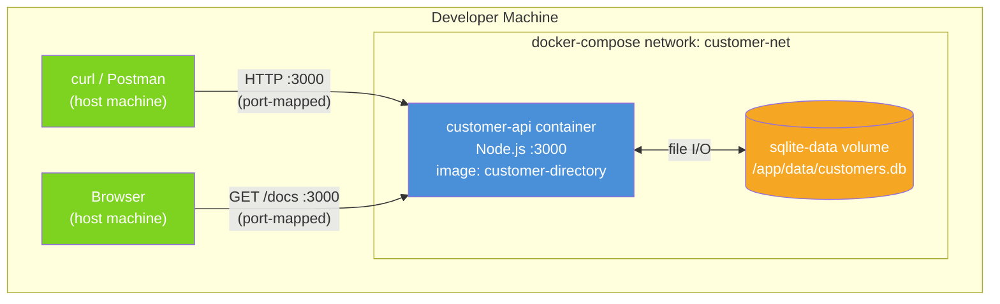

**Key points:**
- Single container, port `3000` mapped to the host.
- SQLite database file persisted on a named Docker volume (`sqlite-data`) — survives container restarts.
- No sidecar or external services required locally. OTel export is a no-op when `OTEL_EXPORTER_OTLP_ENDPOINT` is unset.

---

### Production — Kubernetes

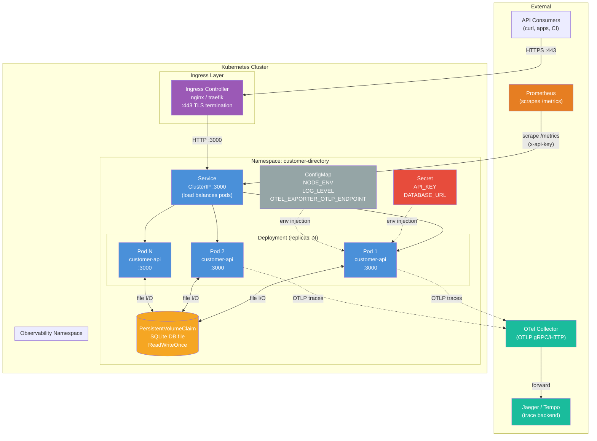

**Key points:**

| Concern | Decision |
|---|---|
| **TLS** | Terminated at the Ingress controller — pods communicate over plain HTTP internally |
| **Auth** | `API_KEY` injected from a Kubernetes `Secret` (not a `ConfigMap`) — never baked into the image |
| **SQLite + replicas** | SQLite uses `ReadWriteOnce` PVC — only one pod writes at a time. For true horizontal scaling, swap to PostgreSQL and a `ReadWriteMany` volume |
| **Metrics scraping** | Prometheus scrapes `GET /metrics` directly via the ClusterIP Service; the API key is stored in a Prometheus `basicAuth` / `bearerToken` scrape config |
| **Traces** | Pods push OTLP spans to the OTel Collector sidecar or a cluster-wide collector deployment; the collector forwards to Jaeger/Tempo |
| **Graceful shutdown** | Kubernetes sends `SIGTERM` → pod drains in-flight requests (max 10s) → `SIGKILL` after `terminationGracePeriodSeconds` |

---

## Azure Landing Zone

This section defines the Azure infrastructure required to host the Customer Directory Service in a public-sector-aligned landing zone. It follows the [Azure Landing Zone (ALZ) conceptual architecture](https://learn.microsoft.com/en-us/azure/cloud-adoption-framework/ready/landing-zone/) with a hub-and-spoke network topology, centralised governance, and defence-in-depth security controls.

---

### Management Group and Subscription Structure

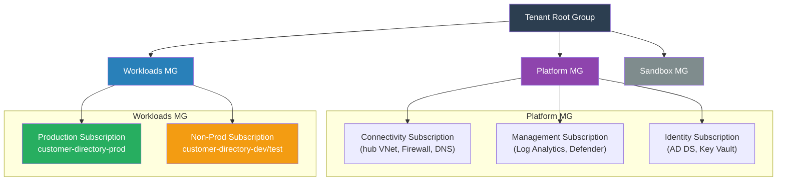

**Policy assignments at Management Group level:**
- `Deny` public IP on resources without explicit exemption
- `Require` diagnostic settings forwarded to central Log Analytics Workspace
- `Require` private endpoints for PaaS services (Key Vault, ACR, etc.)
- `Audit` resources without resource locks on production

---

### Hub-and-Spoke Network Topology

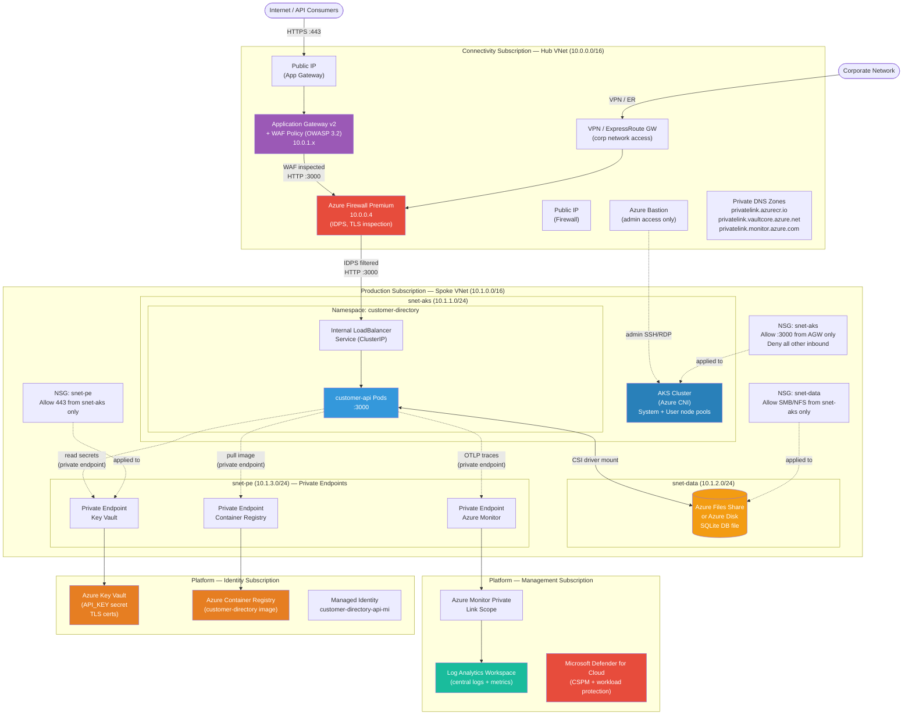

---

### Resource Inventory

| Resource | SKU / Tier | Purpose |
|---|---|---|
| **Application Gateway v2** | WAF_v2 | TLS termination, WAF (OWASP 3.2), path-based routing to AKS |
| **Azure Firewall Premium** | Premium | IDPS, TLS inspection, east-west + egress filtering |
| **AKS Cluster** | Standard, Azure CNI | Hosts customer-api pods; system + user node pools |
| **Azure Files / Managed Disk** | Premium LRS | Persistent volume for SQLite DB file (CSI driver) |
| **Azure Container Registry** | Premium | Private image registry; geo-replication optional |
| **Azure Key Vault** | Standard | Stores `API_KEY` secret, TLS certificates; accessed via private endpoint |
| **User-Assigned Managed Identity** | — | Grants AKS workload identity access to Key Vault and ACR — no stored credentials |
| **Log Analytics Workspace** | Pay-as-you-go | Central sink for AKS diagnostics, container logs, Azure Monitor metrics |
| **Azure Monitor / App Insights** | — | Receives OTLP traces via Azure Monitor OpenTelemetry distro |
| **Microsoft Defender for Cloud** | Defender for Containers | Runtime threat detection on AKS nodes and pods |
| **Azure Bastion** | Standard | Secure admin access to nodes — no public SSH |
| **Private DNS Zones** | — | Name resolution for all private endpoints within the VNet |
| **Network Security Groups** | — | Subnet-level micro-segmentation |
| **Azure Policy** | Built-in + custom | Governance guardrails at Management Group level |

---

### Security Controls

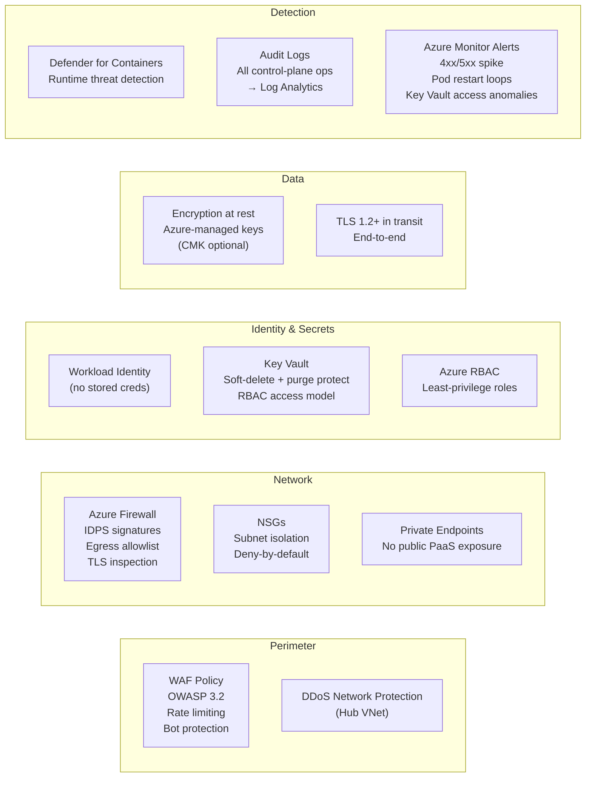

**API Key handling in Azure:**
- `API_KEY` is stored as a Key Vault secret, not in a ConfigMap or environment variable baked into the image.
- AKS uses the [Secrets Store CSI Driver](https://learn.microsoft.com/en-us/azure/aks/csi-secrets-store-driver) with the Azure Key Vault provider to mount the secret as an environment variable at pod startup.
- The pod's User-Assigned Managed Identity has `Key Vault Secrets User` RBAC role — no client secrets or certificates required.

---

### AKS Configuration

```yaml
# Relevant AKS cluster settings
nodeResourceGroup: rg-customer-directory-nodes-prod
networkPlugin: azure          # Azure CNI — pods get VNet IPs
networkPolicy: calico          # Pod-level network policies
privatecluster: true           # API server not publicly reachable
authorizedIPRanges: []         # Disabled when private cluster
enableOIDCIssuer: true         # Required for Workload Identity
enableWorkloadIdentity: true
monitoringAddon: true          # Sends metrics to Log Analytics
defenderAddon: true            # Defender for Containers
nodeOSUpgradeChannel: NodeImage
autoUpgradeChannel: patch      # Auto-patch node OS, not k8s minor versions

# Node pools
systemPool:
  vmSize: Standard_D2s_v5
  count: 2
  mode: System
  taints: [CriticalAddonsOnly=true:NoSchedule]

userPool:
  vmSize: Standard_D4s_v5
  minCount: 2
  maxCount: 10
  mode: User
  enableAutoScaling: true
```

---

### Observability Pipeline

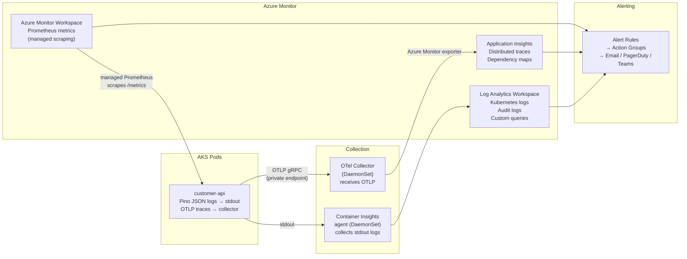

**Prometheus scraping in Azure:**
Azure Monitor managed Prometheus scrapes `GET /metrics` on each pod. The `API_KEY` is stored in a Kubernetes `Secret` and referenced in the `PodMonitor` scrape config via `bearerTokenSecret` — it is never stored in plain text in the scrape configuration.

---

### CI/CD and Image Supply Chain

```mermaid
graph LR
    DEV["Developer\npush to main"] -->|"triggers"| PIPE["Azure DevOps Pipeline\nor GitHub Actions"]
    PIPE -->|"npm run lint\nnpm test\nnpm run build"| BUILD["Build + Test"]
    BUILD -->|"docker build\n--no-cache"| IMG["Container Image"]
    IMG -->|"trivy scan\n(CRITICAL = fail)"| SCAN["Image Vulnerability Scan"]
    SCAN -->|"az acr push\n(digest-pinned)"| ACR2["Azure Container Registry\nPremium\n(geo-replicated)"]
    ACR2 -->|"AKS pulls\nvia private endpoint"| AKS2["AKS Deployment\n(rolling update)"]
    AKS2 -->|"smoke test\nGET /health"| VERIFY["Post-deploy Verification"]
```

**Supply chain controls:**
- Images are tagged by Git SHA and digest-pinned in Kubernetes manifests — no `latest` tags in production.
- ACR Tasks can run `trivy` on push; images with `CRITICAL` CVEs are quarantined.
- Azure Policy `Require container images to come from approved registries` blocks pods pulling from public registries.

---

### Environment Summary

| Environment | Subscription | AKS Replicas | SQLite Storage | Notes |
|---|---|---|---|---|
| **Local** | n/a | n/a | Docker volume | `docker compose up` |
| **Dev** | customer-directory-nonprod | 1 | Azure Files (Standard) | Auto-deployed on PR merge to `develop` |
| **Test** | customer-directory-nonprod | 1 | Azure Files (Standard) | Integration + load tests |
| **Production** | customer-directory-prod | 2–10 (autoscale) | Azure Disk Premium LRS | Manual approval gate before deploy |

> **SQLite scaling note:** SQLite with a `ReadWriteOnce` disk works for single-writer workloads. If the production replica count exceeds 1 and concurrent writes are required, migrate to **Azure Database for PostgreSQL Flexible Server** (private endpoint, Entra auth) and update the Prisma provider from `sqlite` to `postgresql`.

---

## Architecture

The service follows a **layered architecture** with strict unidirectional dependencies:

```
HTTP Request
     │
     ▼
┌─────────────────────────────────────────────────────┐
│                  Fastify HTTP Server                │
│  ┌──────────────┐  ┌──────────────────────────────┐ │
│  │  OTel Plugin │  │  Correlation ID Hook (onReq) │ │
│  └──────────────┘  └──────────────────────────────┘ │
│  ┌──────────────────────────────────────────────────┐│
│  │           Auth Middleware (preHandler)           ││
│  └──────────────────────────────────────────────────┘│
│  ┌──────────────────────────────────────────────────┐│
│  │              Route Handlers                      ││
│  │  /health  /customers  /metrics  /docs            ││
│  └──────────────────────────────────────────────────┘│
│  ┌──────────────────────────────────────────────────┐│
│  │           Centralised Error Handler              ││
│  └──────────────────────────────────────────────────┘│
└─────────────────────────────────────────────────────┘
     │
     ▼
┌─────────────────────────────────────────────────────┐
│                   Service Layer                     │
│  CustomerService (business logic, conflict checks)  │
└─────────────────────────────────────────────────────┘
     │
     ▼
┌─────────────────────────────────────────────────────┐
│                 Repository Layer                    │
│  CustomerRepository (Prisma queries, DB mapping)    │
└─────────────────────────────────────────────────────┘
     │
     ▼
┌─────────────────────────────────────────────────────┐
│              Prisma ORM + SQLite DB                 │
└─────────────────────────────────────────────────────┘
```

### Request Flow

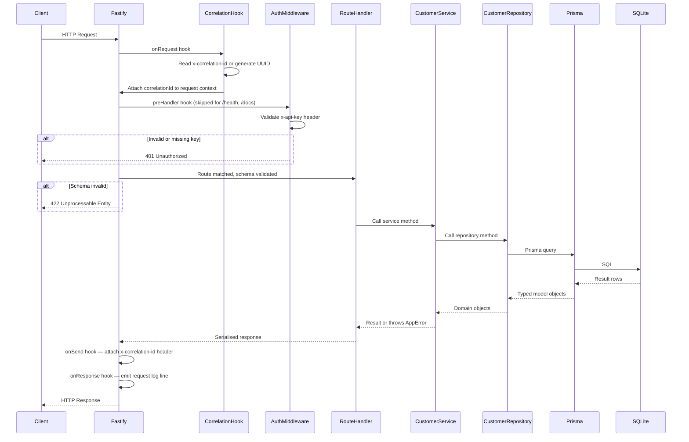

---

## Components and Interfaces

### Component Map

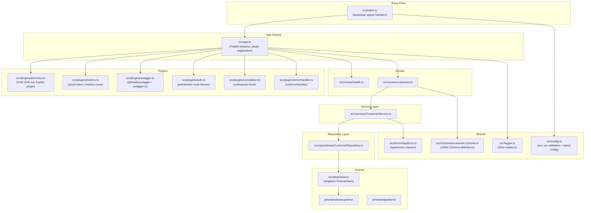

### Key Component Responsibilities

| Component | Responsibility |
|---|---|
| `src/index.ts` | Bootstrap: validate config, init OTel, create Fastify app, run migrations, start server, register signal handlers |
| `src/app.ts` | Fastify factory: register all plugins and routes, export for testing |
| `src/config.ts` | Read and validate all environment variables at startup; fail fast if required vars are missing |
| `src/plugins/telemetry.ts` | Initialise the OTel Node SDK with HTTP and Prisma instrumentations; register as a Fastify plugin so spans are available in route context |
| `src/plugins/correlation.ts` | `onRequest` hook: read `x-correlation-id` header or generate a UUID v4; attach to `request.correlationId`; `onSend` hook: write it back to response header |
| `src/plugins/auth.ts` | Fastify plugin that registers a `preHandler` hook on all routes except `/health`, `/docs`, and `/docs/json`; compares `x-api-key` against `config.apiKey` |
| `src/plugins/errorHandler.ts` | `setErrorHandler`: maps `AppError` subclasses to HTTP status codes; catches unknown errors and returns 500; logs full stack at `error` level; never leaks internals |
| `src/plugins/metrics.ts` | Initialises `prom-client` default metrics; registers `GET /metrics` route (auth-protected); exposes `http_requests_total` and `http_request_duration_seconds` counters updated via `onResponse` hook |
| `src/plugins/swagger.ts` | Registers `@fastify/swagger` with OpenAPI 3.0 config and `@fastify/swagger-ui` at `/docs`; public routes |
| `src/routes/health.ts` | `GET /health` — no auth, returns `{ status, version }` |
| `src/routes/customers.ts` | CRUD routes with JSON Schema attached; delegates to `CustomerService` |
| `src/services/CustomerService.ts` | Business logic: UUID generation, timestamp management, email conflict detection, search/pagination orchestration |
| `src/repositories/CustomerRepository.ts` | All Prisma queries; maps Prisma model to domain type; translates Prisma `P2002` unique constraint error to `ConflictError` |
| `src/errors/AppError.ts` | Base class + subclasses: `NotFoundError`, `ConflictError`, `ValidationError`, `UnauthorizedError` |
| `src/schemas/customer.schema.ts` | Shared JSON Schema objects for request bodies and response shapes; single source of truth for validation and OpenAPI docs |

---

## Data Models

### Prisma Schema

```prisma
model Customer {
  id        String   @id @default(uuid())
  name      String
  email     String   @unique
  phone     String?
  createdAt DateTime @default(now())
  updatedAt DateTime @updatedAt
}
```

### Domain Type (TypeScript)

```typescript
interface Customer {
  id: string;          // UUID v4
  name: string;        // 1–255 chars
  email: string;       // RFC 5322, unique
  phone: string | null; // 0–50 chars, optional
  createdAt: string;   // ISO 8601 UTC
  updatedAt: string;   // ISO 8601 UTC
}
```

### API Request/Response Shapes

**POST /customers body / PUT /customers/:id body:**
```json
{ "name": "string", "email": "string", "phone": "string?" }
```

**GET /customers response:**
```json
{
  "data": [Customer],
  "total": 42,
  "page": 1,
  "pageSize": 20
}
```

**Error response (all error cases):**
```json
{ "error": "string", "message": "string" }
```

---

## Folder / Module Structure

```
customer-directory-service/
├── prisma/
│   ├── schema.prisma
│   └── migrations/
├── src/
│   ├── index.ts              # Entry point: bootstrap + signal handlers
│   ├── app.ts                # Fastify factory (exported for tests)
│   ├── config.ts             # Env var validation, typed config object
│   ├── logger.ts             # Pino instance (JSON, stdout)
│   ├── db/
│   │   └── prisma.ts         # Singleton PrismaClient
│   ├── errors/
│   │   └── AppError.ts       # Typed error hierarchy
│   ├── plugins/
│   │   ├── auth.ts           # API key preHandler
│   │   ├── correlation.ts    # Correlation ID hooks
│   │   ├── errorHandler.ts   # Centralised error formatting
│   │   ├── metrics.ts        # Prometheus / prom-client
│   │   ├── swagger.ts        # OpenAPI + Swagger UI
│   │   └── telemetry.ts      # OTel SDK init
│   ├── routes/
│   │   ├── health.ts
│   │   └── customers.ts
│   ├── schemas/
│   │   └── customer.schema.ts # JSON Schema (validation + OpenAPI)
│   ├── services/
│   │   └── CustomerService.ts
│   └── repositories/
│       └── CustomerRepository.ts
├── tests/
│   ├── unit/
│   │   ├── validator.test.ts
│   │   └── customerService.test.ts
│   └── integration/
│       ├── health.test.ts
│       ├── customers.test.ts
│       └── metrics.test.ts
├── Dockerfile
├── docker-compose.yml
├── .env.example
├── package.json
└── tsconfig.json
```

---

## Key Design Decisions

### 1. OTel Initialisation Must Happen Before Everything Else

The OTel Node SDK patches Node.js built-ins (HTTP, `async_hooks`) at import time. `src/index.ts` must call `initTelemetry()` as its very first statement — before importing Fastify, Prisma, or any application code — otherwise auto-instrumentation will miss spans.

```
index.ts execution order:
  1. initTelemetry()          ← must be first
  2. validateConfig()
  3. buildApp()
  4. prisma.$connect() + migrate
  5. fastify.listen()
  6. register SIGTERM/SIGINT handlers
```

When `OTEL_EXPORTER_OTLP_ENDPOINT` is not set, the SDK is initialised with a `NoopSpanExporter` so the application starts cleanly without any OTel collector.

### 2. Correlation ID Flow

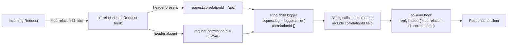

The correlation ID is stored on the Fastify `request` object and used to create a **Pino child logger** scoped to that request. Every `request.log.info(...)` call automatically includes the `correlationId` field without any manual threading.

### 3. Auth Middleware Scope

The auth plugin uses Fastify's `addHook('preHandler', ...)` scoped to a sub-router that excludes `/health`, `/docs`, and `/docs/json`. This is cleaner than a global hook with an exclusion list — the public routes are registered outside the auth-scoped scope, so they never see the auth hook.

```
Fastify instance
├── GET /health          ← no auth scope
├── GET /docs            ← no auth scope
├── GET /docs/json       ← no auth scope
└── [auth-scoped plugin]
    ├── preHandler: validateApiKey
    ├── GET /customers
    ├── POST /customers
    ├── GET /customers/:id
    ├── PUT /customers/:id
    ├── DELETE /customers/:id
    └── GET /metrics
```

### 4. Graceful Shutdown Sequence

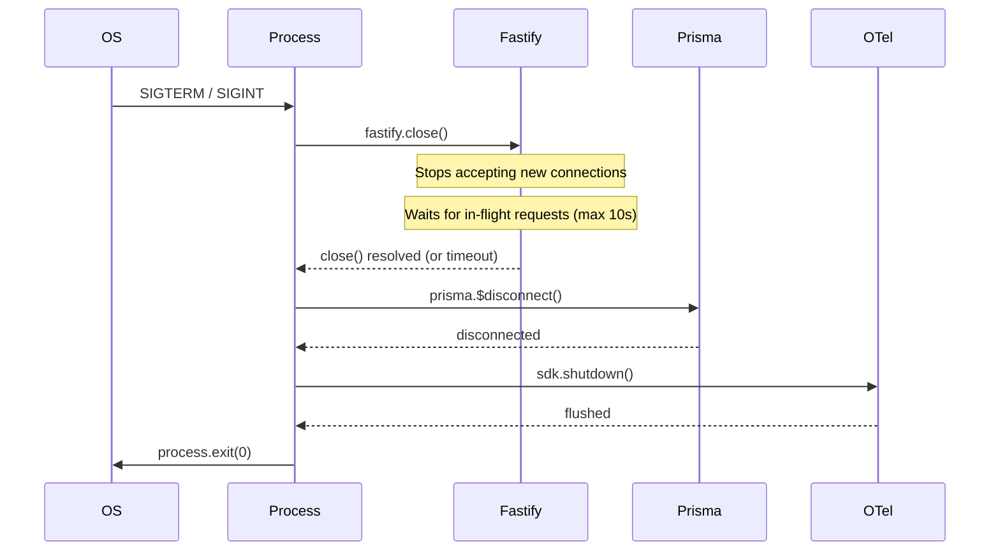

If `fastify.close()` does not resolve within 10 seconds, a `setTimeout` fires `process.exit(1)` to prevent the pod from hanging during Kubernetes termination.

### 5. Validation as Single Source of Truth

JSON Schema objects in `src/schemas/customer.schema.ts` are attached directly to Fastify route definitions. Fastify uses them for:
- **Request validation** (returns 422 on schema violation)
- **Response serialisation** (strips undeclared fields)
- **OpenAPI spec generation** (via `@fastify/swagger`)

This means the validation rules, API docs, and response shapes are all derived from one place.

### 6. Repository Error Translation

Prisma throws `PrismaClientKnownRequestError` with code `P2002` on unique constraint violations. The `CustomerRepository` catches this and re-throws a `ConflictError` (an `AppError` subclass). The `errorHandler` plugin then maps `ConflictError` → HTTP 409. This keeps Prisma as an implementation detail — the service layer never sees Prisma error types.

---

## Correctness Properties

*A property is a characteristic or behavior that should hold true across all valid executions of a system — essentially, a formal statement about what the system should do. Properties serve as the bridge between human-readable specifications and machine-verifiable correctness guarantees.*

### Property 1: Customer creation round-trip

*For any* valid customer input (name, email, optional phone), creating a customer via `POST /customers` and then retrieving it via `GET /customers/:id` SHALL return an object whose `name`, `email`, and `phone` fields exactly match the input.

**Validates: Requirements 3.1, 4.1**

---

### Property 2: Server-assigned fields are valid on creation

*For any* valid customer input, the response from `POST /customers` SHALL contain an `id` that is a valid UUID v4, and `createdAt` and `updatedAt` values that are valid ISO 8601 UTC timestamps within a reasonable window of the request time.

**Validates: Requirements 3.2, 3.3**

---

### Property 3: Name field validation boundary

*For any* string used as the `name` field: if the string is empty or exceeds 255 characters, `POST /customers` SHALL respond with HTTP 422; if the string is between 1 and 255 characters inclusive, the request SHALL be accepted (assuming other fields are valid).

**Validates: Requirements 3.4, 3.7**

---

### Property 4: Email field validation

*For any* string used as the `email` field: if the string is not a valid RFC 5322 email address, `POST /customers` SHALL respond with HTTP 422; if it is a valid email address, the request SHALL be accepted (assuming other fields are valid).

**Validates: Requirements 3.5, 3.8**

---

### Property 5: Search results always match the search term

*For any* set of customers in the database and any non-empty search string, every customer returned in `GET /customers?search=<term>` SHALL have a `name` or `email` field that contains the search string (case-insensitively). No customer whose `name` and `email` both do not contain the search string SHALL appear in the results.

**Validates: Requirements 5.6, 5.7**

---

### Property 6: List response is ordered by createdAt descending

*For any* list response from `GET /customers`, the `data` array SHALL be sorted such that `data[i].createdAt >= data[i+1].createdAt` for all valid indices `i`.

**Validates: Requirements 5.8**

---

### Property 7: Update round-trip

*For any* existing customer and any valid update input, performing `PUT /customers/:id` and then `GET /customers/:id` SHALL return an object whose `name`, `email`, and `phone` match the update input, and whose `updatedAt` is greater than or equal to the original `createdAt`.

**Validates: Requirements 6.1, 6.2**

---

### Property 8: Delete removes the record

*For any* existing customer, performing `DELETE /customers/:id` SHALL respond with HTTP 204, and a subsequent `GET /customers/:id` for the same `id` SHALL respond with HTTP 404.

**Validates: Requirements 7.1**

---

### Property 9: Error responses always conform to the error schema

*For any* request that results in an error (4xx or 5xx), the response body SHALL be a JSON object with exactly the shape `{ "error": string, "message": string }` and SHALL NOT contain a stack trace or internal file path.

**Validates: Requirements 8.2, 8.3, 8.5**

---

### Property 10: Correlation ID is echoed in response

*For any* request that includes an `x-correlation-id` header, the response SHALL include an `x-correlation-id` header with the same value. *For any* request that does not include an `x-correlation-id` header, the response SHALL include an `x-correlation-id` header containing a valid UUID v4.

**Validates: Requirements 9.3, 9.5**

---

## Error Handling

### Error Hierarchy

```
AppError (base)
├── UnauthorizedError   → HTTP 401
├── ValidationError     → HTTP 422
├── NotFoundError       → HTTP 404
├── ConflictError       → HTTP 409
└── (unknown/unhandled) → HTTP 500
```

### Error Handler Behaviour

The Fastify `setErrorHandler` callback:

1. Checks if the error is an `AppError` instance → maps to the appropriate HTTP status and formats `{ error, message }`.
2. Checks if the error is a Fastify validation error (schema mismatch) → returns 422 with field details.
3. For all other errors → logs the full stack at `error` level, returns 500 with a generic message.
4. Never includes `err.stack`, file paths, or Prisma internals in the response body.

### Startup Failures

Two conditions cause immediate process termination with a non-zero exit code:
- `API_KEY` environment variable is not set (checked in `config.ts` before the server starts).
- Database connection fails during `prisma.$connect()` (checked before `fastify.listen()`).

Both conditions log a descriptive error message to stderr before exiting.

---

## Testing Strategy

### Dual Testing Approach

The test suite combines **unit tests** for isolated logic and **integration tests** for end-to-end HTTP behaviour.

**Unit tests** (`tests/unit/`) cover:
- `customer.schema.ts` validator: valid inputs, missing required fields, malformed emails, out-of-range pagination values, phone length boundary.
- `CustomerService`: all CRUD and list operations using a mocked `CustomerRepository`; conflict detection; UUID and timestamp assignment.

**Integration tests** (`tests/integration/`) cover:
- Each API endpoint (Requirements 1–7, 11) using a real Fastify instance with a temporary in-memory or file-based SQLite database isolated per test run.
- The full CRUD round-trip: create → retrieve → update → verify updated fields.
- Auth middleware: missing key, wrong key, correct key.
- Pagination defaults and boundary validation.
- Search filtering and ordering.

### Property-Based Testing

The service contains pure business logic (validation, search filtering, ordering, UUID/timestamp assignment) that is well-suited to property-based testing. The test suite uses **[fast-check](https://github.com/dubzzz/fast-check)** as the PBT library.

Each property test runs a minimum of **100 iterations** and is tagged with a comment referencing the design property:

```
// Feature: customer-directory-service, Property 1: Customer creation round-trip
```

**Properties to implement as PBT tests:**

| Property | Test file | fast-check arbitraries |
|---|---|---|
| P1: Creation round-trip | `customers.test.ts` | `fc.record({ name: fc.string({minLength:1, maxLength:255}), email: fc.emailAddress(), phone: fc.option(fc.string({maxLength:50})) })` |
| P2: Server-assigned fields | `customers.test.ts` | Same as P1 |
| P3: Name validation boundary | `validator.test.ts` | `fc.string()` with length constraints |
| P4: Email validation | `validator.test.ts` | `fc.emailAddress()` and `fc.string()` |
| P5: Search results match term | `customers.test.ts` | `fc.array(customerArb)` + `fc.string({minLength:1})` |
| P6: List ordering | `customers.test.ts` | `fc.array(customerArb, {minLength:2})` |
| P7: Update round-trip | `customers.test.ts` | `customerArb` for create + `customerArb` for update |
| P8: Delete removes record | `customers.test.ts` | `customerArb` |
| P9: Error response schema | `customers.test.ts` | Various error-triggering inputs |
| P10: Correlation ID echo | `customers.test.ts` | `fc.uuid()` and absent header |

**Non-PBT tests** (example-based or smoke):
- Health check response shape and latency.
- Auth 401 responses (missing/wrong key).
- Pagination defaults (page=1, pageSize=20).
- Metrics endpoint format.
- Docs endpoints accessible without auth.
- Graceful shutdown sequence (integration test with SIGTERM).

### Coverage Target

`npm test` runs all unit and integration tests via **Vitest** and reports line coverage. The minimum threshold is **80% line coverage** across `src/`.


---

## Azure Hosting Cost Estimate

All prices are **East US region, pay-as-you-go, USD, May 2025**. These are estimates based on published list prices — actual costs depend on traffic volume, log ingestion, negotiated EA/CSP discounts, and reservation commitments. Sources: [Azure pricing pages](https://azure.microsoft.com/en-us/pricing/), [vantage.sh](https://instances.vantage.sh/azure/vm/d4s-v5), [Microsoft Learn — Defender for Containers pricing](https://learn.microsoft.com/en-us/answers/questions/1692318/defender-for-container-pricing-question).

---

### Assumptions

| Parameter | Value |
|---|---|
| Region | East US |
| AKS user node pool (prod) | 2–4 × Standard_D4s_v5 (4 vCPU, 16 GiB) |
| AKS system node pool | 2 × Standard_D2s_v5 (2 vCPU, 8 GiB) |
| Monthly traffic | ~1M API requests, ~50 GB through firewall |
| Log ingestion | ~10 GB/month to Log Analytics |
| SQLite storage | Azure Disk Premium LRS, 32 GB |
| Hours per month | 730 |

---

### Production Environment — Monthly Breakdown

#### Compute (AKS)

| Resource | Detail | Unit price | Monthly |
|---|---|---|---|
| AKS Standard tier (control plane) | SLA-backed | $0.10/hr × 730 hrs | **$73** |
| System node pool — D2s_v5 × 2 | Always on | $0.096/hr × 2 × 730 hrs | **$140** |
| User node pool — D4s_v5 × 2 (baseline) | Min replicas | $0.192/hr × 2 × 730 hrs | **$280** |
| User node pool — D4s_v5 × 2 (burst) | ~20% of time at 4 nodes | $0.192/hr × 2 × 146 hrs | **$56** |
| **Compute subtotal** | | | **~$549** |

#### Networking

| Resource | Detail | Unit price | Monthly |
|---|---|---|---|
| Azure Firewall Premium | $2.46/hr deployment + $0.022/GB data | 730 hrs + 50 GB | **~$1,798** |
| Application Gateway v2 + WAF | $0.246/hr fixed + $0.008/CU/hr (est. 2 CU) | 730 hrs | **~$192** |
| Azure Bastion Standard | $0.29/hr | 730 hrs | **$212** |
| Public IPs × 2 (AGW + Firewall) | $0.004/hr each | 730 hrs × 2 | **$6** |
| VNet peering (hub ↔ spoke) | $0.01/GB | 50 GB | **$1** |
| **Networking subtotal** | | | **~$2,209** |

#### Storage

| Resource | Detail | Monthly |
|---|---|---|
| Azure Disk Premium LRS (32 GB) | SQLite persistent volume | **$5** |
| Azure Container Registry Premium | $0.667/day flat + storage | **$20** |
| **Storage subtotal** | | **~$25** |

#### Security & Observability

| Resource | Detail | Monthly |
|---|---|---|
| Defender for Containers | $7/vCore/month — 4 user nodes × 4 vCPU = 16 vCores | **$112** |
| Log Analytics (10 GB ingestion) | $2.76/GB after 5 GB free tier | **$14** |
| Azure Monitor / Application Insights | $2.76/GB — ~2 GB OTLP traces | **$6** |
| Azure Key Vault Standard | $0.03/10k ops — ~50k ops/month | **$2** |
| **Security & Observability subtotal** | | **~$134** |

---

### Production Total

| Category | Monthly | Annual |
|---|---|---|
| Compute (AKS) | $549 | $6,588 |
| Networking | $2,209 | $26,508 |
| Storage | $25 | $300 |
| Security & Observability | $134 | $1,608 |
| **Production total** | **~$2,917** | **~$35,000** |

---

### Non-Production Environment (Dev + Test) — Monthly

Scaled down: single user node, no Firewall Premium, no Bastion.

| Resource | Monthly |
|---|---|
| AKS Free tier (no SLA) | $0 |
| D2s_v5 × 1 user node | $70 |
| Application Gateway v2 (Standard, no WAF) | $90 |
| Azure Firewall Standard (not Premium) | ~$750 |
| Log Analytics (within 5 GB free tier) | $0 |
| ACR Standard | $20 |
| Key Vault | $2 |
| **Non-prod total** | **~$932/month** |

---

### Cost Optimisation Options

Azure Firewall Premium at ~$1,800/month is the dominant cost driver. The table below shows the main levers:

| Option | Est. Monthly Saving | Trade-off |
|---|---|---|
| **1-year Reserved capacity — Firewall** | ~$630 (35%) | Upfront 1-year commitment |
| **1-year Reserved VMs — AKS nodes** | ~$190 (35%) | Upfront 1-year commitment |
| **Downgrade to Azure Firewall Standard** | ~$600 | Loses IDPS + TLS inspection — may not meet public-sector requirements |
| **Replace Firewall + AGW with Azure Front Door Premium** | ~$1,400 | No hub-and-spoke private network; WAF + DDoS + CDN at ~$330/month; loses east-west inspection |
| **Spot instances for burst user nodes** | ~80% on burst compute | Pods can be evicted; only safe for stateless workloads |
| **Azure Savings Plan (compute)** | ~15–20% on all compute | Flexible across VM families, no reservation lock-in |

#### Optimised Scenarios

| Scenario | Monthly | Annual |
|---|---|---|
| Pay-as-you-go (as designed) | ~$2,917 | ~$35,000 |
| 1-year reserved — Firewall + VMs | ~$2,100 | ~$25,200 |
| Firewall Standard + reserved VMs | ~$1,500 | ~$18,000 |
| Azure Front Door Premium (no hub Firewall) | ~$900 | ~$10,800 |

---

### Total Cost of Ownership (All Environments)

| Environment | Monthly | Annual |
|---|---|---|
| Production (pay-as-you-go) | ~$2,917 | ~$35,000 |
| Non-production (dev + test) | ~$932 | ~$11,184 |
| **Combined list price** | **~$3,849** | **~$46,184** |
| **Combined with 1-year reservations** | **~$3,032** | **~$36,384** |

> Use the [Azure Pricing Calculator](https://azure.microsoft.com/en-us/pricing/calculator/) with your EA/CSP agreement applied to get a binding quote. EA customers typically receive 15–30% off list price on compute and networking, which would reduce the annual total to approximately **$32,000–$39,000** at list, or **$22,000–$27,000** with reservations.
